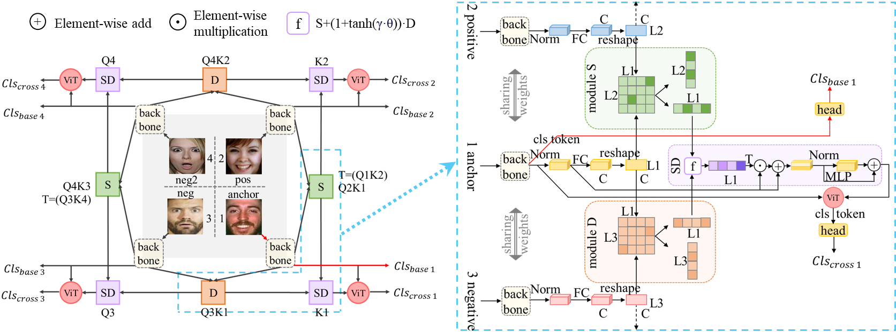

#  QCS:Feature Refining from Quadruplet Cross Similarity for Facial Expression Recognition
By Chengpeng Wang, Li Chen, Lili Wang, Zhaofan Li, Xuebin Lv.

This is a PyTorch implementation of the paper QCS:Feature Refining from Quadruplet Cross Similarity for Facial Expression Recognition, based on [POSTER++](https://github.com/Talented-Q/POSTER_V2).

## Introduction
<div align="center">

</div>
On facial expression datasets with complex and numerous feature types, where the significance and dominance of labeled features are difficult to predict, facial expression recognition(FER) encounters the challenges of inter-class similarity and intra-class variances, making it difficult to mine effective features. We aim to solely leverage the feature similarity among facial samples to address this. We introduce the Cross Similarity Attention (CSA), an input-output position-sensitive attention mechanism that harnesses feature similarity across different images to compute the corresponding global spatial attention. Based on this, we propose a four-branch circular framework, called Quadruplet Cross Similarity (QCS), to extract discriminative features from the same class and eliminate redundant ones from different classes synchronously to refine cleaner features. The symmetry of the network ensures balanced and stable training and reduces the amount of CSA interaction matrix. Contrastive residual distillation is utilized to transfer the information learned in the cross module back to the base network. The cross-attention module exists during training, and only one base branch is retained during inference.

## Installation
We have only tested the code on Windows in PyCharm.
### Requirements:
- numpy==1.21.6
- Pillow==9.3.0
- sklearn==0.0.post1
- matplotlib==3.5.3
- torch==1.13.0+cu117
- torchvision==0.14.0+cu117
- tqdm==4.64.1
- seaborn==0.12.2

## Prepareing
### pretrained model:
dwonload pretrained model [ir50.pth](https://drive.google.com/file/d/1FV8kUSeVbZ815iWt-YIYiQrCDChrhO2G/view?usp=sharing) (on the Ms-Celeb-1M) into `QCS-main/models/pretrain`.
### datasets:
download the [RAF-DB](http://www.whdeng.cn/raf/model1.html), [FERPlus](https://github.com/Microsoft/FERPlus), [AffectNet](http://mohammadmahoor.com/affectnet/) datasets and put the images into `datas/RAF-DB/basic`, `datas/FERPlus/img` and `datas/AffectNet/Manually_trainval_croped` respectively.  download the [trainval lists](https://drive.google.com/file/d/1y2fiwdcgQbVEuz3uW4ZVb9XCXhnoY5eA/view?usp=sharing) and put them into `datas/RAF-DB`, `datas/FERPlus` and `datas/AffectNet` respectively.


## Checkpoints
we provide the QCS and DCS checkpoints in each dataset.
dataset | Model | Acc. | Checkpoint
--- |:---:|:---:|:---:|
RAF-DB | DCS | 92.57 | [link]
RAF-DB | QCS | 92.47 | [link]
FERPlus | DCS | 91.25 | [link]
FERPlus | QCS | 91.21 | [link]
AffectNet-7 | DCS | 67.29 | [link]
AffectNet-7 | QCS | 66.91 | [link]

## Training
The default training parameters are set by `parser.add_argument()` in each `main_*_*.py`.

You can train the QCS or DCS models on each dataset, run as follows: 
```
python main_*_*.py --dataset (RAF-DB|FERPlus|AffectNet-7|AffectNet-8) --epochs (40|100|200) --batch-size (24|48)
```


You can continue your training, run as follows: 
```
python main_*_*.py --resume path/to/checkpoint
```

## Evaluation
You can evaluate our models , run as follows: 
```
python main_*_*.py --evaluate path/to/checkpoint
```
## Citation
```
@inproceedings{Wang2024QCS,
  title={QCS:Feature Refining from Quadruplet Cross Similarity\\for Facial Expression Recognition},
  author={Chengpeng Wang, Li Chen, Lili Wang, Zhaofan Li, Xuebin Lv},
  journal={arXiv preprint arXiv:},
  year={2024}
}
```
