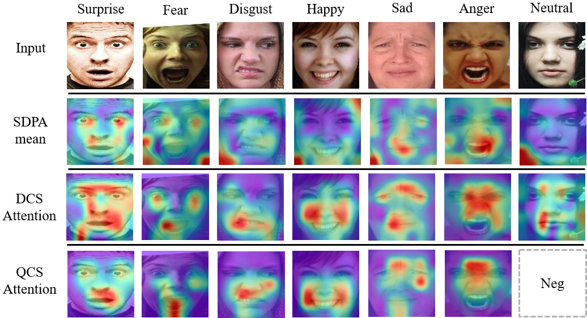

#  QCS:Feature Refining from Quadruplet Cross Similarity for Facial Expression Recognition
By Chengpeng Wang, Li Chen, Lili Wang, Zhaofan Li, Xuebin Lv.

This is a PyTorch implementation of the paper QCS:Feature Refining from Quadruplet Cross Similarity for Facial Expression Recognition, based on [POSTER++](https://github.com/Talented-Q/POSTER_V2).

## Introduction
<div align="center">

</div>
Facial expression recognition faces challenges where labeled significant features in datasets are mixed with unlabeled redundant ones. In this paper, we introduce Cross Similarity Attention (CSA) to mine richer intrinsic information from image pairs, overcoming a limitation when the Scaled Dot-Product Attention of ViT is directly applied to calculate the similarity between two different images. Based on CSA, we simultaneously minimize intra-class differences and maximize inter-class differences at the fine-grained feature level through interactions among multiple branches. Contrastive residual distillation is utilized to transfer the information learned in the cross module back to the base network. We ingeniously design a four-branch centrally symmetric network, named Quadruplet Cross Similarity (QCS), which alleviates gradient conflicts arising from the cross module and achieves balanced and stable training. It can adaptively extract discriminative features while isolating redundant ones. The cross-attention modules exist during training, and only one base branch is retained during inference, resulting in no increase in inference time. Our proposed method  achieves state-of-the-art performance results on several FER datasets.
<div align="center">

</div>

## Installation
We have only tested the code on Windows in PyCharm.
### Requirements:
- numpy==1.21.6
- Pillow==9.3.0
- sklearn==0.0.post1
- matplotlib==3.5.3
- torch==1.13.0+cu117
- torchvision==0.14.0+cu117
- tqdm==4.64.1
- seaborn==0.12.2

## Prepareing
### pretrained model:
dwonload pretrained model [ir50.pth](https://drive.google.com/file/d/1FV8kUSeVbZ815iWt-YIYiQrCDChrhO2G/view?usp=sharing) (on the Ms-Celeb-1M) into `QCS-main/models/pretrain`.
### datasets:
download the [RAF-DB](http://www.whdeng.cn/raf/model1.html), [FERPlus](https://github.com/Microsoft/FERPlus), [AffectNet](http://mohammadmahoor.com/affectnet/) datasets and put the images into `datas/RAF-DB/basic`, `datas/FERPlus/img` and `datas/AffectNet/Manually_trainval_croped` respectively.  download the [trainval lists](https://drive.google.com/file/d/1mo6YV-bMWH8yugjgwW1qa9TVLuIi3xA0/view?usp=sharing) and put them into `datas/RAF-DB`, `datas/FERPlus` and `datas/AffectNet` respectively.


## Checkpoints
Compared to methods that introduce additional landmark information, our method achieves state-of-the-art performance results on several FER datasets by mining richer intrinsic information.

We provide the checkpoints with training logs in each dataset. A small portion of the checkpoints that were trained using the old version of the code are currently not provided due to naming compatibility issues with network layers. ‡ means pre-trained on the AffectNet-8.
dataset | Model | Acc. | Checkpoint & Log  
--- |:---:|:---:|:---:|
RAF-DB | DCS | 92.57 | [link](https://drive.google.com/drive/folders/1vv1WtDHj5DGDXFVt--_8NBxkAp8VF_73?usp=sharing)
RAF-DB | QCS | 92.50 | [link](https://drive.google.com/drive/folders/1enyzfD1G8HPSPF1Tu6JkgMuirrKQs_mE?usp=sharing)
RAF-DB | QCS‡ | 93.02 | [link](https://drive.google.com/drive/folders/1b25WkmbEqjC9dKsjIrGKUCxpywINjk5e?usp=sharing/)
FERPlus | DCS | 91.41 | [link](https://drive.google.com/drive/folders/1UoQ4xZYDGc0cooQd7BzhDfb58e3wwnjO?usp=sharing)
FERPlus | QCS | 91.41 | [link](https://drive.google.com/drive/folders/19O9BjP7Lhd1DX9r8-RxSmvO1aAUQHoBO?usp=sharing)
FERPlus | QCS‡ | 91.85 | [link](https://drive.google.com/drive/folders/15jqH56e2dVtJx0oPzzcAmvaDAFa0rc01?usp=sharing)
AffectNet-7 | DCS | 67.66 | [link](https://drive.google.com/drive/folders/1ch6144M9HuEbX9tSB0XrYbYxzNfuCZ0u?usp=sharing)
AffectNet-7 | QCS | 67.94 | [link](https://drive.google.com/drive/folders/1fo9iyz6qLotOSUUCoGllGN-DiPqlHfp6?usp=sharing)
AffectNet-8 | DCS | 64.40 | [link](https://drive.google.com/drive/folders/1_kXBuZxYXkHOQxUaUx12_oSyKoLU5puM?usp=sharing)
AffectNet-8 | QCS | 64.30 | [link](https://drive.google.com/drive/folders/1WFbisNzL-YqqMNSN0sq8vIaXYuh4_1Xm?usp=sharing/)

## Training
The default training parameters are set by `parser.add_argument()` in each `main_*_*.py`.

You can train the QCS or DCS models on each dataset, run as follows: 
```
python main_*_*.py --dataset (RAF-DB|FERPlus|AffectNet-7|AffectNet-8) --epochs (40|100|200) --batch-size (24|48)
```


You can continue your training, run as follows: 
```
python main_*_*.py --resume path/to/checkpoint
```

## Evaluation
You can evaluate our models , run as follows: 
```
python main_*_*.py --evaluate path/to/checkpoint
```
## Citation
```
@inproceedings{Wang2024QCS,
	title={QCS:Feature Refining from Quadruplet Cross Similarity for Facial Expression Recognition},
	author={Chengpeng Wang and Li Chen and Lili Wang and Zhaofan Li and Xuebin Lv},
	booktitle={arXiv preprint arXiv:2411.01988},
	year={2024}
}
```
